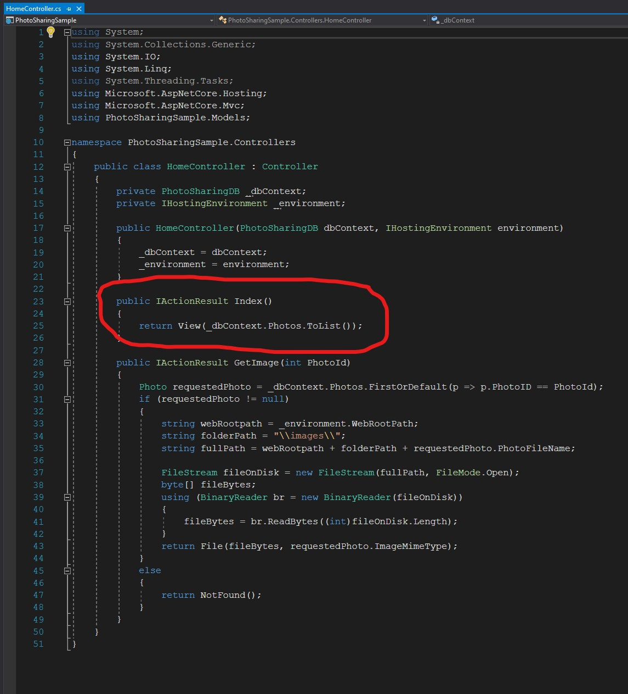
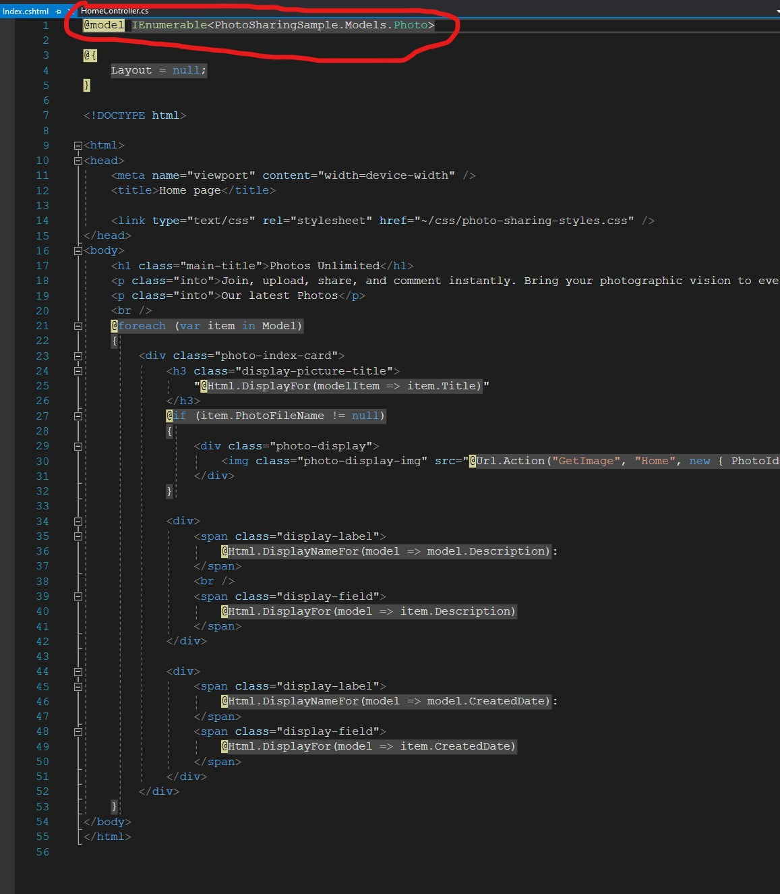

# Module 1: Exploring ASP.NET Core MVC

# Lesson 3: Introduction to ASP.NET Core MVC 

### Demonstration: How to Explore an ASP.NET Core MVC Application


En el **HomeControlller.cs** buscamos el siguiente codigo que envia una lista de fotos a la vista

```cs
    public IActionResult Index()
       {
          return View(_dbContext.Photos.ToList());
       }
```





En el **Index.cshtml** buscamos el siguiente codigo que recoge esa lista de fotos

```cs
     @model IEnumerable<PhotoSharingSample.Models.Photo>
```




EJecutamos y vemos la lista de fotos


En el **Startup.cs** buscamos el siguiente codigo que le dice al patron que utilice las rutas por defecto

```cs
     app.UseMvcWithDefaultRoute();
```


En el **HomeController.cs** buscamos el siguiente codigo: Clase HomeController hereda de Controller

```cs
    public class HomeController : Controller
```


En el **HomeController.cs** buscamos el siguiente codigo que es lo que hace el controlador en la accion GetImage

```cs
     Photo requestedPhoto = _dbContext.Photos.FirstOrDefault(p => p.PhotoID == PhotoId);
       if (requestedPhoto != null)
       {
            string webRootpath = _environment.WebRootPath;
            string folderPath = "\\images\\";
            string fullPath = webRootpath + folderPath + requestedPhoto.PhotoFileName;

            FileStream fileOnDisk = new FileStream(fullPath, FileMode.Open);
            byte[] fileBytes;
            using (BinaryReader br = new BinaryReader(fileOnDisk))
            {
                fileBytes = br.ReadBytes((int)fileOnDisk.Length);
            }
            return File(fileBytes, requestedPhoto.ImageMimeType);
       }
       else
       {
            return NotFound();
       }
```


En el **Index.cshtml** buscamos el siguiente codigo que llamara a la accion GetImage para pintar la foto seleccionada

```cs
    <div class="photo-display">
          
       </div>
```


